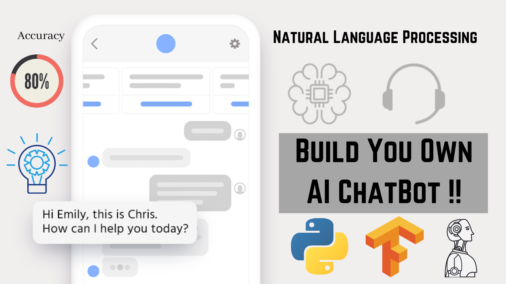

# ChatBot_Tensorflow_NLP
Artificial Intelligent ChatBot using Tensorflow and NLP that understand the Context and Intent of Human Language.

💯👉 FREEBIRDS CREW 👈🤖
#FreeBirdsCrew #WeLearnandGrowTogether
🔥Hey Guys!! Want to Learn about ChatBots?🤖 So the Solution is Here.
This is the GitHub Repository for ChatBot using Tensorflow and NLP and the Video Tutorial for the Same include the following Topics -

1. What are ChatBots?

2. What ChatBots Can Do?

3. Architecture and Working of ChatBots

4. Core Processes of ChatBots

5. Use Cases of ChatBots

6. Top Healthcare ChatBots

7. Top Companies that Implement ChatBots in Their Business.

8. Top Platforms to Build ChatBots and Tools used in ChatBot Development.

9. Practical Work - Build One Contextual ChatBot Using Python, Tensorflow, and NLP.

It's a very Informative Session that discloses about ChatBots and Their Internal Working Architecture along with Programming.

This Session is useful for both Technical and Non-Technical Persons.

YouTube - https://lnkd.in/esEC6bE

Telegram - https://t.me/freebirdscrew
